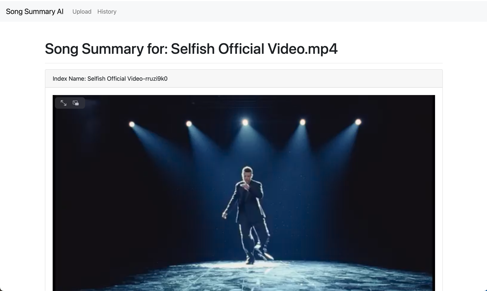
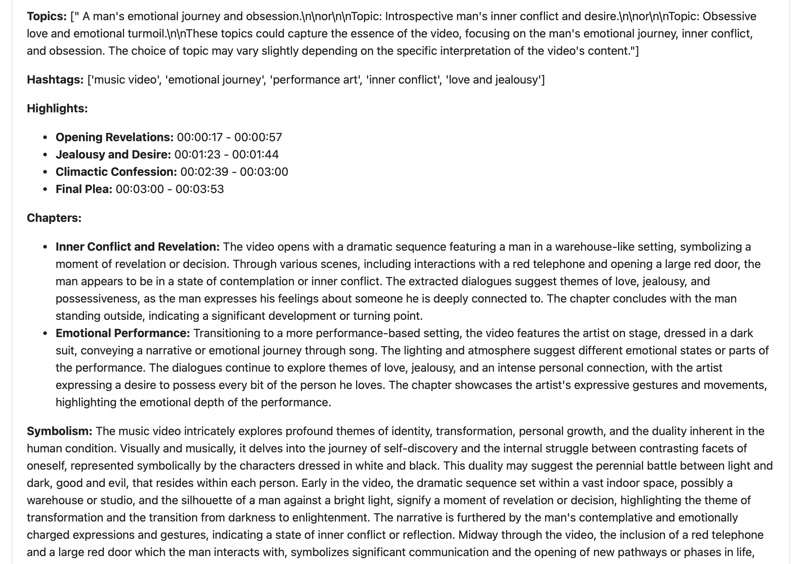
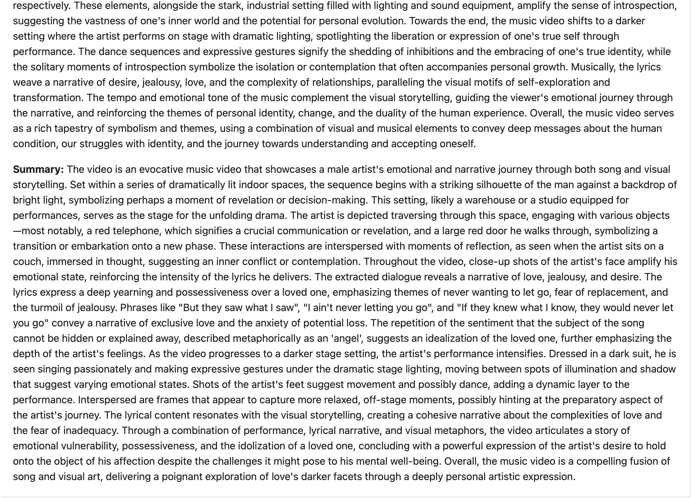

# Song Summary AI
This is a sample project detailing an app called Song Summary AI, powered by Twelve Labs' Pegasus-1 model which has multimodal understanding. The idea for this app is to allow users to upload their favorite music videos, and the app will proceed to  analyze and provide interpretations of the music video. It will provide the following:
- topics mentioned in the video
- hashtags that can be associated with the music video
- highlights of key moments in the video, including listed timeframes (e.g., 00:01:28 - 00:03:10)
- description of specific "chapters" throughout the video
- a section describing the various symbolism that can be interpreted by seeing the artist(s) within the music video's environments
- a summary of the music video itself

The app is built using Flask for efficiency, with Bootstrap to make the frontend look more modern. The way that it works is that the user simply uploads an .mp4 file of their favorite music video, and the Twelve Labs API will begin to process the video. After a few minutes, the video summary will be ready. From there, the user can both watch and listen to the music video while reading an analysis provided by Pegasus-1 and some carefuly prompting.

A useful tool added to the Flask app is to allow users to both save the video and the corresponding analysis, the latter of which is stored in a SQLite database. They can go to the History tab, and from there they can see all the past videos that they have processed and review the analysis along with rewatching the video they had uploaded.

Challenges faced:
- The Twelve Labs tutorial made it simple to understand how to work and interact with their API in Python. There was sufficient documentation to get a POC going to know how to start using it. The next step then was to think of a good framework to build the app on. Initially, Django was being purused, as it seemed to have more batteries-included capabilities that would make it suitable for an internal business tool, where users can login and upload their own videos. However, it was realized that for the purposes of this project, something like Flask would be more than sufficient, along with having capabilities such as storing summaries and allowing for users to watch uploaded videos.
- The development process was mainly smooth, but there was a hiccup that made things hard to reproduce. For example, when clearing the database and videos and restarting from a blank slate to test the reproducibility, it was encountered often that there was an error: `ERROR in app: Unexpected Error: cannot access local variable 'response' where it is not associated with a value`. A fix for this was to not reuse the result variable `res` when capturing the response from the API. This seemed to cause unexpected errors, but by changing the variable name for each call to the API the bug went away.
- One issue was that the highlights section would return the result in seconds, the solution was to use a Python function `filters.py` which is loaded into HTML to parse the results so that it would be in an HH:MM:SS format so it can be better followed in the video from the slider at the bottom.

Further work:
- Given more time, it would be great to make the frontend have more details, to give it elements of music and Gen AI vibes.

Examples of app:

